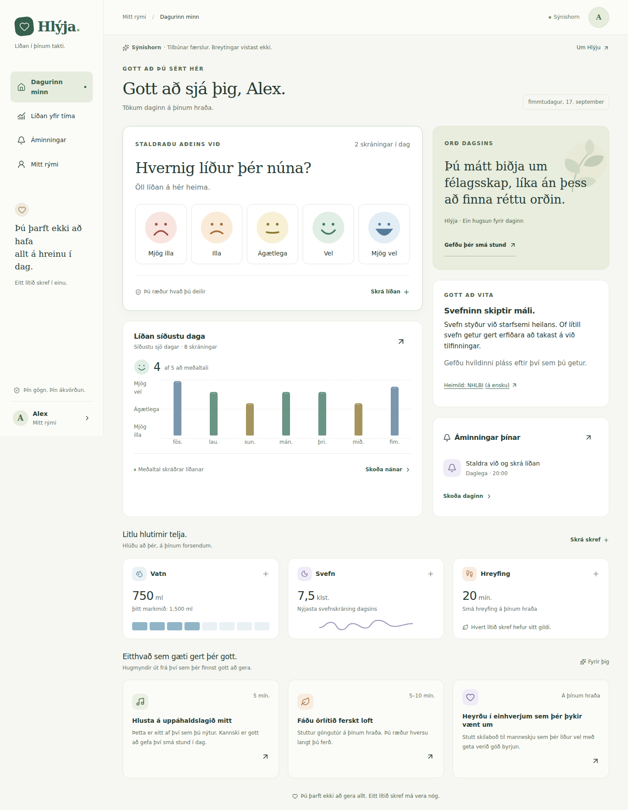

# Hlýja

**Líðan í þínum takti.** Íslenskt vefforrit fyrir skapskráningu, persónulegar hugmyndir og litlar áminningar í hversdeginum. Hlýja er vinnuheiti; vörumerkja- og lénakönnun hefur ekki verið framkvæmd.



[Skoða símaútlit](docs/images/hlyja-mobile.png)

## Staða verkefnisins

Fyrsta virk þróunarútgáfa. Viðmót og staðbundið sýnishorn virka án þjónustulykla. Kóðinn fyrir Google-innskráningu, gagnageymslu, aðstandendaboð, tölvupóst og Web Push er innifalinn, en raunveruleg notkun þarf þjónustuuppsetningu og samþykktar rekstrarforsendur. Þetta er ekki fullgilt klínískt kerfi eða neyðareftirlit.

**Byrja hér:** [Uppsetning og gangsetning](docs/UPPSETNING.md).

```bash
npm ci
cp .env.example .env.local
npm run dev
```

Opnaðu `http://localhost:3000/demo` fyrir gagnvirkt sýnishorn með tilbúnum færslum. `/demo?nyr=1` sýnir upphafskynningu nýs notanda. Sýnishornið sendir ekki gögn eða tölvupósta og breytingar hverfa við endurhleðslu.

## Hvað er komið?

| Hluti            | Virkni                                                                                                        |
| ---------------- | ------------------------------------------------------------------------------------------------------------- |
| Íslenskt viðmót  | Síma- og tölvuviðmót, stór val fyrir líðan, róleg litun, lyklaborð og skert hreyfing                          |
| Google + prófíll | OAuth/PKCE með Supabase, nafn, valkvætt fæðingarár, tímabelti, áhugamál og persónulegar hugmyndir             |
| Skapskráning     | Margar sjálfstæðar færslur á dag; líðan 1–5, orka, tilfinningar, valkvæður texti og tími                      |
| Yfirlit          | Dagur/vika/mánuður, meðaltöl, dreifing og allar einstakar færslur                                             |
| Hversdagurinn    | Handvirk skráning á vatni, svefni, hreyfingu og skrefum                                                       |
| Áminningar       | Endurteknir tímar fyrir lyf, líðan, vatn og svefn; staðfesting eða slepping einstaks tíma                     |
| Læknistímar      | Tími, lengd, staðsetning, áminning og `.ics` fyrir Apple/iCal + Google-dagatalshlekkur                        |
| Stuðningsaðilar  | Staðfestingarboð, afturkallanlegt samþykki notanda, sérstillt regla, biðröð, endurtilraunir og afskráning     |
| Útflutningur     | Valdar skapskráningar í CSV, öll gögn í JSON og staðfest tölvupóstsending CSV                                 |
| Varðveisla       | PostgreSQL + RLS, óbreytanlegar mælingar, UUID, endursending án tvískráningar og valkvæð IndexedDB-biðgeymsla |
| Prófanir         | TypeScript, ESLint, Vitest, raunveruleg PostgreSQL/RLS-próf í PGlite, Playwright og axe                       |

## Málfar og símaútlit

Skapsvalið er aðalatriði forsíðunnar, með stórum snertiflötum í síma. Daglega birtast ný **orð dagsins** úr banka með 31 frumsömdum texta og **fróðleiksmoli** úr 12 heimildastuddum textum. Persónulegar tilkynningar eru valkvæðar og hafa forskoðun í Mitt rými.

[Textastefna, heimildir og aðgengisviðmið](docs/MALFAR-OG-ADGENGI.md). Nýja SQL-breytingin `202609180002_personal_notifications.sql` þarf að vera komin inn áður en þessi útgáfa er sett í notkun.

## Tæknigrunnur

Next.js App Router · React · TypeScript · Supabase PostgreSQL/Auth · Zod · Web Push · Resend. Enginn greiningar- eða auglýsingarekjakóði. Engin LLM-þjónusta fær notendagögn; persónulegar hugmyndir eru valdar með einfaldri, gagnsærri rökfræði.

```text
src/app/                 Síður og sannreyndar API-leiðir
src/components/          Íslenskt viðmót, eyðublöð og biðgeymslusamstilling
src/lib/domain/          Týpur, sannprófun, dagsetningar, stuðningsregla og útflutningur
src/lib/server/          Aðgangur, tölvupóstur, síðuð gagnasókn og tilkynningavinnsla
supabase/migrations/     Gagnagrunnur, reglur, RLS og RPC-aðgerðir
tests/                   Eininga-, gagnagrunns- og vafrapróf
docs/                    Uppsetning, arkitektúr, rekstur og áframhald
```

## Prófa

```bash
npm run check
npm run format:check
npx playwright install chromium webkit
npm run test:e2e
```

CI keyrir án raunverulegra heilsugagna eða framleiðslulykla. Google/Resend/Web Push þurfa viðbótarprófun gegn stilltu prófunarumhverfi áður en farið er í notkun. RLS-prófin keyra sama migration í innbyggðri PostgreSQL-vél; staðfesta þarf einnig Supabase-uppsetninguna sjálfa.

## Mikilvæg mörk

- Hlýja **greinir ekki sjúkdóma, metur ekki sjálfsvígshættu og breytir ekki lyfjaskömmtum**. Aðstandendaregla er val notandans en ekki klínísk viðmiðun.
- Tilkynningar geta tafist eða mistekist. Skortur á skráningu er aldrei túlkaður sem vanlíðan. Enginn neyðarviðbragðsaðili fylgist með kerfinu.
- Engin heildarlausn getur lofað algjöru tapi á gögnum útilokuðu. Kóðinn ver gegn tvískráningu og staðfestir vistun; afritun, endurheimt og eftirlit þarf að setja upp og prófa. Sjá [rekstur](docs/REKSTUR.md).
- Biðgeymsla á eigin tæki þarf samþykki. Hún er ekki sérstakt dulkóðað gagnahólf og getur tapast við hreinsun/eyðingu vafragagna. Sýnishorn er ekki ætlað raunverulegum heilsugögnum.
- Apple HealthKit og Android Health Connect eru **framtíðartengingar**, ekki virkar tengingar í vafra. Sjá [vegvísi](docs/VEGVISIR.md).
- Fyrir almenna notkun þarf ábyrgðaraðila, fullbúna persónuverndarstefnu, hýsingar- og vinnslusamninga, varðveislureglur, endurheimtarpróf og yfirferð viðeigandi sérfræðinga. Sjá [útgáfugátlista](docs/REKSTUR.md).

## Gögn og öryggi

GitHub geymir aðeins kóða, prófunargögn og leiðbeiningar. **Aldrei** setja raunveruleg heilsugögn, `.env.local`, Supabase service role eða skjáskot raunverulegra notenda í þetta opinbera repository. Ekki hafa heilsugögn í GitHub Issues.

[Arkitektúr og ákvarðanir](docs/ARKITEKTUR.md) · [Uppsetning](docs/UPPSETNING.md) · [Rekstur og gagnavarðveisla](docs/REKSTUR.md) · [Vegvísir](docs/VEGVISIR.md) · [Öryggismál](SECURITY.md)
